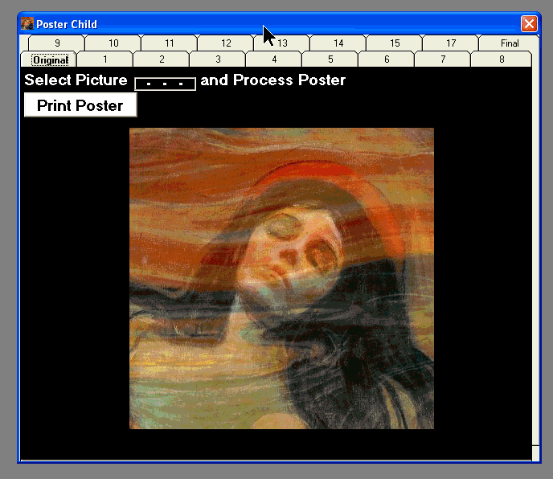



## Print any picture as a 32 x 44 inch poster

### Description

Input any bmp, gif, jpg or wmf graphic of any resolution. The program uses .PaintPicture to resize the original, section it into 16 picture boxes and prints each out sequentially on selectable paper sizes and printers. I borrowed the printer activeX and references are preserved in the archive. Now I can re-wallpaper my place with her pictures ;)
 
### More Info
 

             |
---                |---
**Submitted On**   |2007-08-27 17:39:26
**By**             |[Warren Goff](https://github.com/Planet-Source-Code/PSCIndex/blob/master/ByAuthor/warren-goff.md)
**Level**          |Beginner
**User Rating**    |5.0 (10 globes from 2 users)
**Compatibility**  |VB 6\.0
**Category**       |[Graphics](https://github.com/Planet-Source-Code/PSCIndex/blob/master/ByCategory/graphics__1-46.md)
**World**          |[Visual Basic](https://github.com/Planet-Source-Code/PSCIndex/blob/master/ByWorld/visual-basic.md)
**Archive File**   |[Print\_any\_2080898272007\.zip](https://github.com/Planet-Source-Code/warren-goff-print-any-picture-as-a-32-x-44-inch-poster__1-69216/archive/master.zip)

